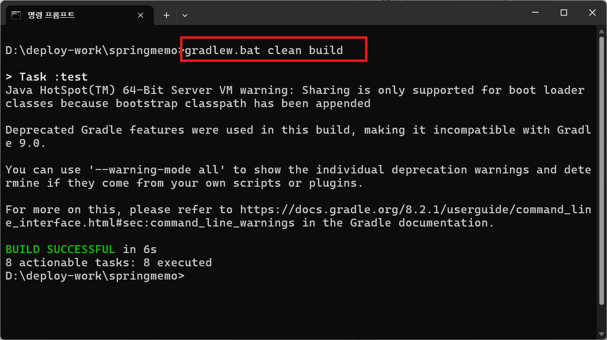

# Docker

## 가상화

낮은 사양의 컴퓨터를 여러 대 사용하는 것보다 높은 사양의 컴퓨터 한 대를 사용하는 편이 비용, 설치공간, 인력, 서버운영, 하드웨어 크기 등 여러 면에서 더 경제적입니다.

#### 하이퍼바이저 가상화

가상환경을 생성하고 CPU와 메모리 리소스를 할당. 호스트 OS는 물리 서버를 직접 관리하고 게스트 OS는 리소스를 나눠 사용하는 물리적인 공간. 분리된 게스트 OS를 가상머신이라고 부름. 가상머신에는 WAS, 데이터베이스 등의 프로그램을 프로세스로 실행. 프로세스가 하드웨어 리소스를 사용하려면 OS에 리소스 사용을 요청해야 합니다. OS에는 이러한 요청을 처리하는 커널이라는 중요한 구성요소가 있습니다. `하이퍼바이저`는 **게스트 OS의 커널과 호스트 OS의 커널간 상호작용**을 가능하게 합니다.  
하이퍼바이저 프로그램 : VirtualBox, VMWare.

#### 컨테이너 가상화

하이퍼바이저 가상화보다 빠르며 소비자의 요구사항이 빠르게 변화함에 따라 애플리케이션도 신속하게 대응할 수 있어야 하기 때문입니다. 리눅스 컨테이너(LXC) 기술에서 시작되었으며 별도의 소프트웨어 없이 커널의 기능만으로 격리된 공간을 만듭니다. 프로세스, 파일시스템, 네트워크 등을 분리하는 네임스페이스와 리소스 사용량을 관리하는 cgroups 기술을 활용하며 이렇게 격리된 공간을 `컨테이너`라고 부릅니다. **커널을 공유하기 때문에 호스트 OS와 다른 종류의 OS를 실행할 수 없다**는 단점이 있음

#### 컨테이너 플랫폼

          컨테이너 플랫폼 =  컨테이너 엔진  +  컨테이너 런타임

`컨테이너 엔진`은 사용자 요청에 따라 컨테이너를 관리하고,  
`컨테이너 런타임`은 커널과 직접 소통해서 실제 컨테이너를 생성

```
[컨테이너 표준]
   └─ OCI (Open Container Initiative)
        ├─ Image Spec
        └─ Runtime Spec

[컨테이너 엔진 / 런타임]
   ├─ Docker Engine
   ├─ containerd
   ├─ CRI-O
   └─ Podman

[오케스트레이션]
   └─ Kubernetes
```

`Docker`는 컨테이너 생태계의 시작점이고, 실제 운영 표준 엔진은 `containerd` / `CRI-O` 쪽으로 이동했습니다.  
현재는 `Docker`는 `개발/학습용`으로 컨테이너 플랫폼의 입문 도구로 사용하고 실제 `운영환경`에서는 경량 런타임 엔진인 `containerd`나 `CRI-O` 사용합니다.

**Docker**

- `컨테이너`(경량 가상화 기술) 기반의 오픈소스 가상화 플랫폼
- OS, 프로그램 등과 같은 소프트웨어를 컨테이너라는 단위로 묶어 별도의 격리된 프로세스를 할당받아 실행시키는 가상 머신 비슷한 도구
- 기존 Hypervisor 엔진을 사용하지 않고, Docker Engine을 통해 Guest OS 없이 실행 가능하다. Guest OS가 없기 때문에 가상머신보다 훨씬 빠른 실행 속도를 보장
- Kitematic(키트매틱) : Docker Toolbox에 포함되어 배포되는 Docker 관리 도구

**containerd**

- 현재 운영 표준
- Docker에서 분리된 경량의 컨테이너 엔진
- 가볍고 빠르다
- `kubernetes(k8s)의 기본엔진`으로 Docker 없이도 동작

**CRI-O**

- Kubernetes만을 위한 컨테이너 런타임으로 `kubernetes(k8s)`에 최적화
- `보안`/경량

**Podman**

- `Red Hat` 계열 Docker 대체 도구
- Docker CLI 호환
- 데몬 없음
- 보안 정책이 엄격한 서버에 사용

```
클라이언트 ->    도커 CLI    ->    도커 데몬
              (도커 명령어)
```

## 윈도우에서 도커 실행환경 구축

### 1. wsl 설치

```sh
c:\> wsl --install
```

### 2. docker desktop 설치

- Windows/macOS에서 Docker를 쓰기 위해 Linux 환경을 대신 만들어주는 관리 도구입니다.”
- "컨테이너 실행 환경 + 관리 도구 패키지"

Docker Desktop 기능  
✔ 자동 설정

- Linux VM 생성
- Docker Engine 설치
- 네트워크 / 볼륨 설정

✔ 관리 기능

- 컨테이너 / 이미지 관리 UI
- 로그 확인
- 리소스 제한(CPU/메모리)

✔ 개발자 기능

- Docker Compose
- Kubernetes (옵션)
- WSL 연동

## [Ubuntu에 도커 설치](https://docs.docker.com/engine/install/ubuntu/)

```sh
# Add Docker's official GPG key:
sudo apt update
sudo apt install ca-certificates curl
sudo install -m 0755 -d /etc/apt/keyrings
sudo curl -fsSL https://download.docker.com/linux/ubuntu/gpg -o /etc/apt/keyrings/docker.asc
sudo chmod a+r /etc/apt/keyrings/docker.asc

# docker apt repository 추가
sudo tee /etc/apt/sources.list.d/docker.sources <<EOF
Types: deb
URIs: https://download.docker.com/linux/ubuntu
Suites: $(. /etc/os-release && echo "${UBUNTU_CODENAME:-$VERSION_CODENAME}")
Components: stable
Signed-By: /etc/apt/keyrings/docker.asc
EOF

sudo apt update

# docker package 설치
sudo apt install docker-ce docker-ce-cli containerd.io docker-buildx-plugin docker-compose-plugin
#
```

## [아마존 리눅스에 도커 설치](https://docs.aws.amazon.com/ko_kr/serverless-application-model/latest/developerguide/install-docker.html)

```bash
# 설치한 패키지 및 패키지 캐시를 업데이트
sudo yum update -y

# 최신 Docker Community Edition 패키지를 설치
sudo yum install -y docker

# 설치한 Docker 버전 확인
docker -v

# Docker 서비스를 시작  (sudo systemctl start docker)
sudo service docker start

# sudo를 사용하지 않고도 docker 명령을 실행할 수 있도록 Docker 그룹에 ec2-user를 추가
sudo usermod -aG docker ec2-user

#로그아웃 후 다시 로그인해서 새 docker 그룹 권한을 취득
exit

# sudo 없이도 Docker 명령을 실행할 수 있는지 확인
docker ps
```

## [도커 CLI 명령어](https://docs.docker.com/reference/cli/docker/)

```
도움말
  docker -v
  docker --help
  docker 명령어 --help

이미지 명령                   생략형
  docker image ls          =  docker images    <= 이미지 리스트 (= docker image ls)
  docker image tag         =  docker tag       <= 이미지 이름 변경
  docker image rm          =  docker rmi       <= 이미지 삭제 (= docker image rm)
  docker image push        =  docker push      <= 도커허브 레지스트리에 이미지 업로드
  docker image pull        =  docker pull      <= 도커허브 레지스트리에 이미지 다운로드
  docker image build       =  docker build     <= 이미지 생성

컨테이너 명령                 생략형
  docker container run     =  docker run       <= 컨테이너 실행
  docker container ps      =  docker ps        <= 컨테이너 리스트 (= docker container ls)
  docker container logs    =  docker logs      <= 컨테이너 로그 확인
  docker container exec    =  docker exec      <= 컨테이너 내부에 접속(또는 컨테이너 내부에 접속하지 않고 명령어만 실행)
  docker container start   =  docker start     <= 컨테이너 시작  -a((attach)포리그라운드 실행되어 실시간 로그 확인) 
  docker container restart =  docker restart   <= 컨테이너 재시작
  docker container stop    =  docker stop      <= 컨테이너 중지
  docker container rm      =  docker rm        <= 컨테이너 삭제
  docker container commit  =  docker commit    <= 실행중인 컨테이너로 이미지 생성

네트워크 명령(생략형 없슴)
  docker network create       <= 네트워크를 생성
  docker network inspect      <= 네트워크의 상세 정보를 확인
  docker network ls           <= 네트워크 목록을 확인
  docker network rm           <= 지정한 네트워크를 삭제
  docker network prune        <= 현재 아무 컨테이너에도 접속하지 않은 네트워크를 모두 삭제
  docker network connect      <= 네트워크에 컨테이너를 새로이 접속
  docker network disconnect   <= 네트워크에서 컨테이너의 접속을 끊음

볼륨 명령(생략형 없슴)
  docker volume create       <= 볼륨을 생성
  docker volume inspect      <= 볼륨의 상세 정보를 확인
  docker volume ls           <= 볼륨 목록을 확인
  docker volume rm           <= 지정한 볼륨을 삭제
  docker volume prune        <= 현재 마운트되지 않은 볼륨을 모두 삭제

도커허브 접속
  docker login     <= 도커허브(레지스트리)에 로그인

```

## 도커 이미지로 mysql DB서버 구축

■ 이미지 다운받고 컨테이너 실행

```sh
sudo docker create volume vtest
sudo docker run -d -p 3306:3306 -e MYSQL_ROOT_PASSWORD=admin -v vtest:/var/lib/mysql --name mysql  mysql:8.0

# ex) docker run -d -p [호스트 port]:[컨테이 port] -e [환경 변수]=[값]
#                  -v [호스트경로]:[컨테이너경로] [docker image]:[tag]
#
#   -d : 백그라운드 실행(--detach)
#   -p : 호스트OS와 컨테이너 포트 매핑(--publish)
#   -e : 환경변수 설정(--env)
#   -v : 호스트OS와 컨테이너 볼륨 매핑(--volume)
#   --name : 컨테이너 이름 지정
```

■ 컨테이너 리스트 확인

```sh
docker ps -a

#   -a : 모든 컨테이너(all. 기본은 실행중인 컨테이너만 조회)
```

■ 컨테이너 접속

```sh
docker exec -it mysql bash      : 종료하고 나올때는 exit

#   -i : STDIN 열기(--interactive)
#   -t : TTY 할당(--tty)
```

■ mysql db서버 접속

```
mysql -u root -p
```

■ 데이터베이스, 테이블 생성

```
sql>
create database shop;
show databases;
show tables;
use shop;
create table emp ( username varchar(20), password varchar(20) );
insert into emp values ('scott','1111');
select * from emp;
```

■ mysql 로그아웃

```sh
sql> exit
```

■ 컨테이너 빠져나오기

```sh
exit
```

■ 컨테이너 리스트 확인

```sh
docker ps -a
```

■ 컨테이너 중지

```sh
docker stop mysql
```

■ 컨테이너 삭제

```sh
docker rm mysql
```

■ 이미지 리스트

```sh
docker images
```

■ 이미지 삭제

```sh
docker rmi 이미지id
```

## docker로 jenkins 설치

```bash
docker pull jenkins/jenkins:lts

# 내려받아진 이미지 repository 명 확인후에
docker images

# 컨테이너 이름 기억해둘것
docker run -d -p 8181:8080 -v /jenkins:/var/jenkins_home --name jm_jenkins -u root jenkins/jenkins:lts

# jenkins 컨테이너가 올라온 것을 확인  -> 컨테이너 ID확인해둘것
$ docker ps

# 초기패스워드 확인
$ docker exec jm_jenkins cat /var/jenkins_home/secrets/initialAdminPassword

# 컨테이너 id 로 로그 확인
$ docker logs c51838a0b6ba
```

## docker로 oracle 설치

```bash
docker pull store/oracle/database-enterprise:12.2.0.1
docker run -d -p 8080:8080 -p 1521:1521 --name orcl store/oracle/database-enterprise:12.2.0.1
docker exec -it oracle bash
```

```bash
# 오라클 서버 접속
$ sqlplus sys as sysdba

# 사용자 계정 리스트
SQL> select \* from dba_users;

# 스키마(접속계정) 생성
sql>create user hr identified by hr;
# ORA-65096: invalid common user or role name
# 해결책 :
# 1. 계정명 앞에 C## 키워드 추가
# 2. 예전의 스크립트 방식 사용설정
#    ALTER SESSION SET "\_ORACLE_SCRIPT" = TRUE;

# 권한부여
sql> GRANT RESOURCE, CONNECT TO HR;
```

```bash
# 오라클 서비스 중지
$ docker stop orcl

# 제거
$ docker rm orcl

```

## 도커 이미지 생성

■ 1. 빌드해서 배포파일(jar) 생성
메이븐인 경우

```bash
mvn clean package -DskipTests
```

그래이들인 경우

```bash
gradlew clean build
```



■ 2. 도커 이미지 생성하고 허브에 업로드하기

A. Dockerfile 작성

```
FROM eclipse-temurin:21-jdk
WORKDIR /app
ARG JAR_FILE=target/\*.jar
COPY ${JAR_FILE} app.jar
ENV TZ=Asia/Seoul
EXPOSE 8080
ENTRYPOINT ["java","-jar","app.jar"]
```

[Eclipse Temurin](https://hub.docker.com/_/eclipse-temurin)(이클립스 테무린)은 Adoptium(구 AdoptOpenJDK) 프로젝트에서 관리하는 고품질의 오픈 소스 자바(Java) 런타임 환경(OpenJDK)입니다. TCK 인증을 통과한 신뢰할 수 있는 무료 JDK로, 널리 사용되는 사실상의 표준 OpenJDK 빌드입니다  
이미지이름: eclipse-temurin:17-jdk-jammy  
그 외에도 OpenJDK build를 지원하는 곳은 Azul zulu 와 Amazon Corretto가 있습니다.

B. 도커 이미지 생성

```bash
docker build -t cyannara/project .
docker images
```

C. 컨테이너 실행

```bash
#컨테이너 실행
docker run -d -p 80:80 --name project cyannara/project

# 컨테이너 리스트 확인
docker ps -a

# 실시간 로그 보기
docker logs -f project
```

D. 브라우저 확인
http://localhost:포트번호

E. 컨테이너 중지하고 삭제

```bash
# 컨테이너 중지
docker stop project

# 컨테이너 삭제
docker rm project
```

F. 도커 이미지 업로드

```bash
docker login -u cyannara -p xxxxx
docker push cyannara/project
```

로컬에서 이미지 빌드하고 레지스트리(도커허브)에 업로드하는 명령만 요약해서 정리

```bash
# local

# 이미지 삭제
docker rmi cyannara/project

# 이미지 빌드
docker build -t cyannara/project .

# 레지스트리 로그인
docker login -u cyannara -p 도커토큰

# 이미지 push
docker push cyannara/project
```

G. EC2에서 도커 컨테이너 실행

```bash
# AWS ec2 서버

# 실행중인 컨테이너 중지
docker stop project

# 컨테이너 삭제
docker rm project

# 이미지 삭제
docker rmi cyannara/project

# 도커 로그인
docker login -u cyannara -p 도커토큰

# 이미지 다운로드
docker pull cyannara/project

# 컨테이너 실행
docker run -d --name project -p 80:80 -v /home/ec2-user:/home/ec2-user cyannara/project
```

H. 브라우저에서 확인

```
http://ec2서버ip:80
```

## mysql + springboot

■ 1. mysql 컨테이너 실행

```bash
# 네트워크 생성
docker network create springboot-mysql-net

# 컨테이너 실행
docker run -d -p 3306:3306 \
       -e MYSQL_ROOT_PASSWORD=admin \
       -e MYSQL_DATABASE=edudb  \
       -e MYSQL_USER=jdbctest  \
       -e MYSQL_PASSWORD=jdbctest  \
       -e TZ=Asia/Seoul   \
       -v vtest:/var/lib/mysql  \
       --net springboot-mysql-net \
       --name mysql-container  mysql:8.0
```

■ 2. spring boot app 컨테이너 재시작

```bash
# 볼륨 생성
docker volume create fileupload-volume

docker stop guestapp
docker rm guestapp
docker rmi cyannara/guestapp
docker run -d --name guestapp \
           -p 80:9090 \
           -v fileupload-volume:/uploadtest \
           --net springboot-mysql-net \
           cyannara/guestapp
```

■ 3. 브라우저에서 확인
http://ip주소:80
