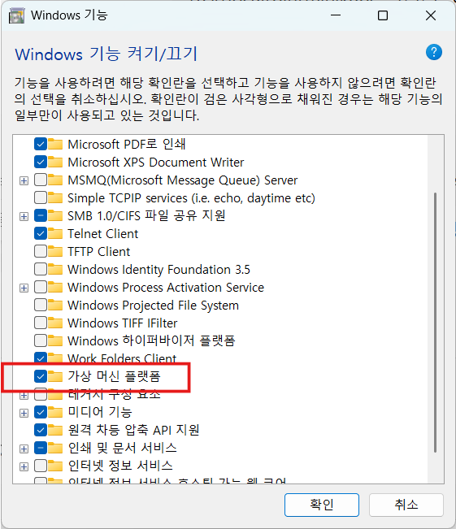
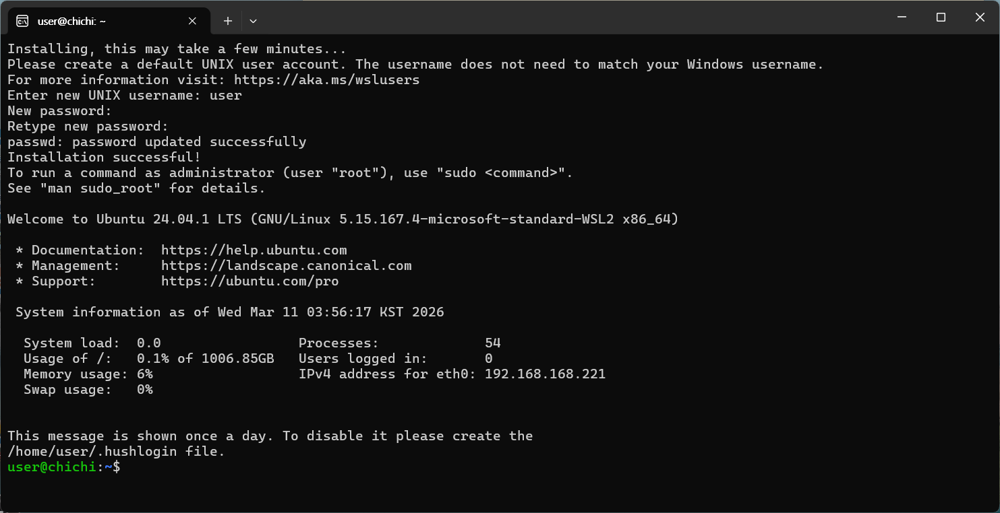
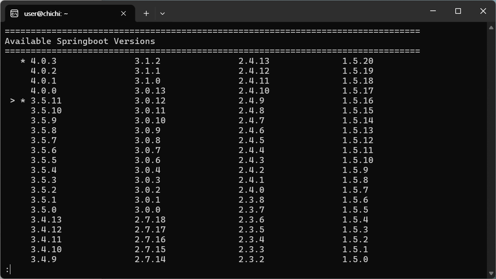
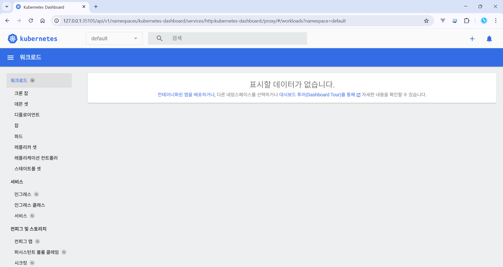

## Kubernetes 로컬 개발 환경 구성

k8s 관련 도구

- Docker
- Helm
- kubectl
- Minikube
- Istio
- K9s

springboot 관련도구

- jq, zip, siege
- jdk
- springboot

설치 확인

```sh
git version                                         && \
docker version -f json | jq -r .Client.Version      && \
java -version 2>&1 | grep "openjdk version"         && \
curl --version  | grep "curl"                       && \
spring --version                                    && \
siege --version 2>&1 | grep SIEGE                   && \
helm version  --short                               && \
kubectl version --client                            && \
minikube version | grep "minikube"                  && \
istioctl version --remote=false
```

사용자를 docker 그룹에 추가 (sudo 없이 실행가능)

```sh
sudo usermod -aG docker $USER
```

### ubutu 실행

wsl ubuntu와 도커 컨테이너를 사용하려면 `가상머신 플랫폼 기능`을 활성화하고 시스템 재시작.  


ubuntu 실행  


### [helm 설치](https://helm.sh/ko/docs/intro/install)

쿠버네티스 패키지를 관리 하는 도구

```sh
sudo apt-get install curl gpg apt-transport-https --yes
curl -fsSL https://packages.buildkite.com/helm-linux/helm-debian/gpgkey | gpg --dearmor | sudo tee /usr/share/keyrings/helm.gpg > /dev/null
echo "deb [signed-by=/usr/share/keyrings/helm.gpg] https://packages.buildkite.com/helm-linux/helm-debian/any/ any main" | sudo tee /etc/apt/sources.list.d/helm-stable-debian.list
sudo apt-get update
sudo apt-get install helm
```

### [kubectl 설치](https://kubernetes.io/ko/docs/tasks/tools/install-kubectl-linux/)

```sh
curl -LO https://dl.k8s.io/release/v1.35.0/bin/linux/amd64/kubectl
sudo install -o root -g root -m 0755 kubectl /usr/local/bin/kubectl
rm kubectl
# 설치 버전 확인
kubectl version --client
```

### Minikube 설치

```sh
curl -LO https://storage.googleapis.com/minikube/releases/latest/minikube-linux-amd64

sudo install -o root -g root -m 0755 minikube-linux-amd64 /usr/local/bin/minikube

rm minikube-linux-amd64
```

install은 파일을 복사하면서 소유자와 권한을 설정하는 명령어로 단순한 cp보다 배포용 바이너리 설치에 많이 사용

### [Istio(이스티오) 설치](<(https://istio.io/latest/docs/setup/getting-started/)>)

```sh
curl -L https://istio.io/downloadIstio | sh -

# /etc/environment 파일의 path 환경변수에 경로 추가
cd istio-1.29.1
export PATH=$PWD/bin:$PATH

# 설치 확인
istioctl version --remote=false
```

```
"istioctl version" 실행하면
client version
cluster(control plane) version

둘 다 조회하려고 합니다.
그래서 Kubernetes API 접속이 안 되면 멈춘 것처럼 보일 수 있습니다.
```

apt install 커맨드로 도구 설치

jq, zip, siege 설치

```sh
sudo apt update
sudo apt install -y jq
sudo apt install -y zip
sudo apt install -y unzip
sudo apt install -y siege
```

java 설치

```sh
sudo apt remove openjdk-17-jdk
sudo apt autoremove

sudo apt-get update

# jdk 패키지 목록 조회
apt-cache search openjdk | grep 21

# jdk 설치
sudo apt-get install -y fontconfig openjdk-21-jdk

# 자바 경로 확인
sudo update-alternatives --config java

# JAVA_HOME 환경변수 선언
sudo nano /etc/environment
JAVA_HOME="/usr/lib/jvm/java-21-openjdk-amd64"

# 설정 적용
source /etc/environment

# 확인 (경로가 출력되어야 함)
echo $JAVA_HOME
$JAVA_HOME/bin/java -version
```

[sdk](https://sdkman.io/install/) install 커맨드로 스프링 부트 CLI 설치

```sh
curl -s "https://get.sdkman.io" | bash
source "$HOME/.sdkman/bin/sdkman-init.sh"
# 설치 확인
sdk version

# spint boot cli 설치
sdk install springboot 3.5.11
spring --version

```



버전 변경

```sh
# 현재 버전 확인
sdk current springboot

# 설치된 버전 확인
sdk list springboot

# 여러 버전이 설치된 경우에 기본버전 변경
sdk default springboot <version(4.0.2)>

# 제거
dk uninstall springboot <버전>
```

## 미니큐브를 사용해 쿠버네티스 클러스터 생성

minikube 클러스터 만들기

```sh
minikube start
```

대시보드 접속하기

```sh
minikube dashboard
```

브라우저 접속: http://127.0.0.1:35105/api/v1/namespaces/kubernetes-dashboard/services/http:kubernetes-dashboard:/proxy/



## k8s 관련 도구 설명

### [Istio(이스티오)](https://istio.io/latest/docs/setup/getting-started/)

- istio는 service meth를 구현할 수 있는 오픈소스
- 코드변경없이 마이크로 서비스들끼리 안전하게 통신하고, 모니터링 할 수 있는 효율적이고 일관된 방법을 제공
- 기본 쿠버네티스 컨트롤러만으로 커버하기 힘들어질때 istio을 도입하여 해결
- 설치 version : 1.29.1
- [referer](https://seoyeonhwng.medium.com/istio-이스티오-이란-무엇인가-13f080222b4)
- [referer](https://joygotohome.tistory.com/106)

### Kiali(키알리)

k8s 클러서터에서 Istio와 같은 서비스 meth를 시작화하고 모니터링하는 도구

### linux 명령어

```sh
# 패키지 제거
sudo apt-get remove openjdk-21-jre

# 2>&1 의 의미는 표준 에러(stderr)를 리다이렉트(redirection)하여 일반출력과 합침
java -version 2>&1
```
