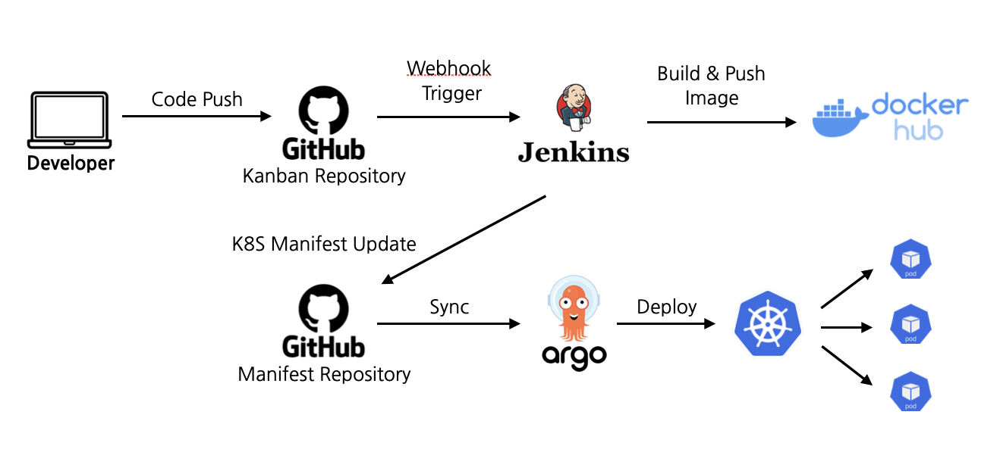

# CD



### ArgoCD 설치하기

```sh
# 네임스페이스 생성
kubectl create namespace argocd

#ArgoCD 설치
kubectl apply -n argocd -f https://raw.githubusercontent.com/argoproj/argo-cd/stable/manifests/install.yaml

# 외부에서 접속할 수 있게 노드포드 설정
kubectl patch svc argocd-server -n argocd -p '{"spec":{"type":"NodePort"}}'

# 초기비밀번호 확인
kubectl get secret argocd-initial-admin-secret -n argocd -o jsonpath="{.data.password}" | base64 -d

# CLI설치(선택)
curl -sSL -o argocd https://github.com/argoproj/argo-cd/releases/latest/download/argocd-linux-amd64
chmod +x argocd
sudo mv argocd /usr/local/bin/

# 접속포트 확인
kubectl get svc -n argocd argocd-server
```

브라우저에서 `마스터노드IP:노드포트` 로 접속

### 제거하기

```sh

강제 삭제
kubectl delete pod --all -n argocd --force --grace-period=0
```

VM running - > 하지만 kubelet / ssh / network 죽음 -> reload로 해결
