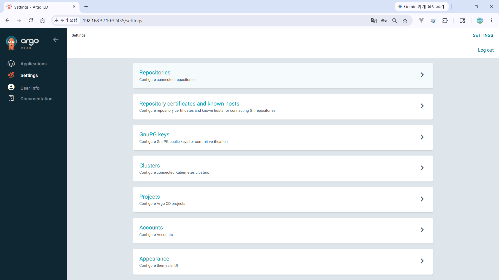
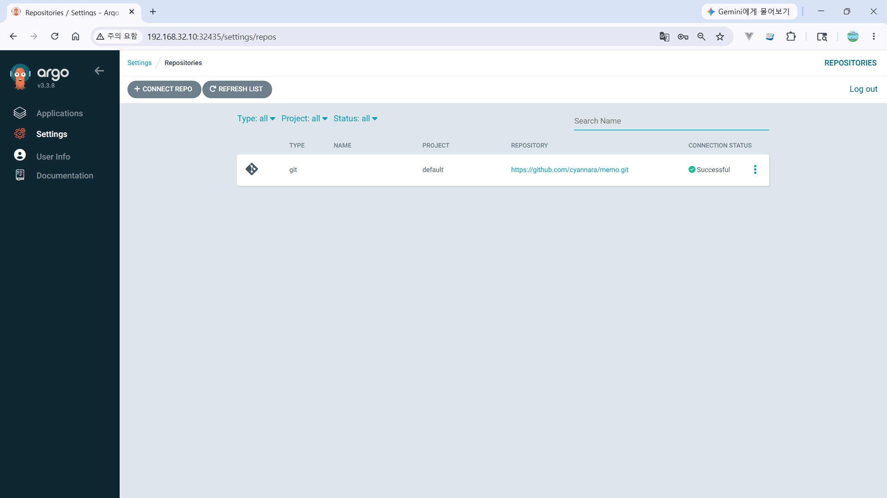
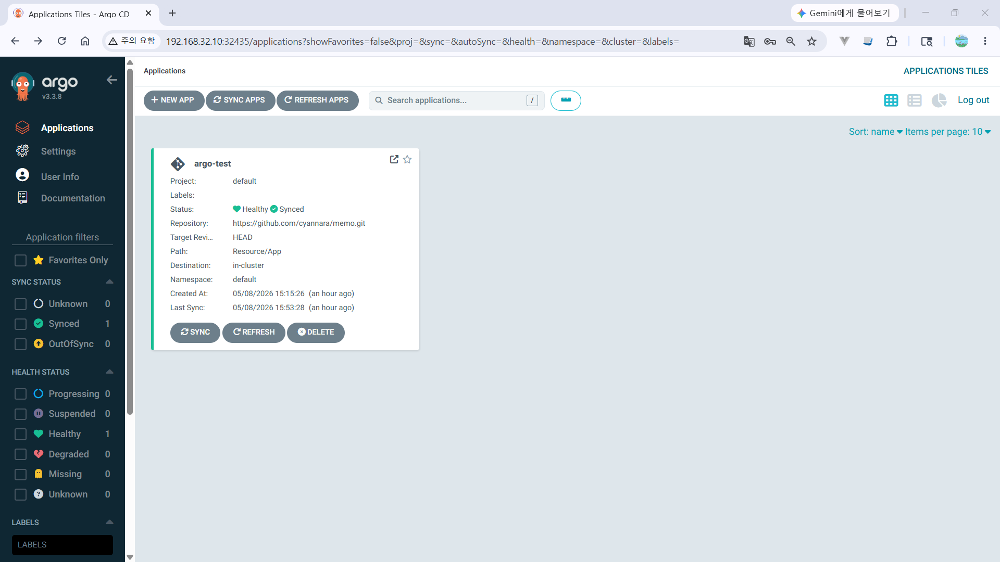
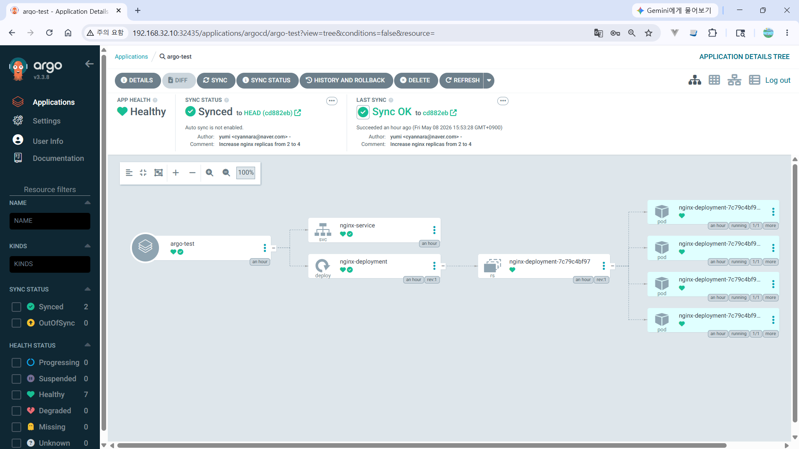

# ArgoCD

Kubernetes 환경에서 애플리케이션의 지속적 배포(CD, Continuous Delivery)를 지원하는 GitOps 기반 도구입니다.


## 실무에서 많이 쓰는 구성

- Helm
- Kustomize
- Github Actions + ArgoCD
- Ingress + HTTPS
- RBAC

헬름(helm) 차트로 패키징된 애플리케이션을 ArgoCD를 통해 배포  
쿠버네티스 리소스를 하나로 묶은 패키지입니다. 이는 yaml 파일의 묶음(패키지)으로, 이 묶음 public 혹은 private registry에 push 해두고, helm 명령어를 통해 Helm Chart를 설치하여 쿠버네티스 리소스를 배포하는 역할을 합니다.

## 실습순서

1. Argo CD 설치
2. nginx 배포
3. Git 연동
4. 자동 sync
5. Helm 연동
6. GitHub Actions 연동

## ArgoCD 설치

```sh
# 네임스페이스 생성
kubectl create namespace argocd

#설치 :  Argo CD Manifests를 사용하여 배포
kubectl apply -n argocd -f https://raw.githubusercontent.com/argoproj/argo-cd/stable/manifests/install.yaml

#다운로드
curl https://raw.githubusercontent.com/argoproj/argo-cd/stable/manifests/install.yaml > install.yaml

#적용
kubectl apply -n argocd -f install.yaml

# 외부에서 접속할 수 있도록 로드밸런서로 설정
kubectl patch svc argocd-server -n argocd -p '{"spec":{"type":"LoadBalancer"}}'

# argo-cd VERSION 확인
VERSION=$(curl -L -s https://raw.githubusercontent.com/argoproj/argo-cd/stable/VERSION)
echo $VERSION

# argo-cd cli 다운로드
curl -sSL -o argocd-linux-amd64 https://github.com/argoproj/argo-cd/releases/download/v$VERSION/argocd-linux-amd64

# Argo CD CLI 실행 파일을 시스템 전역에서 사용할 수 있게 설치
sudo install -m 555 argocd-linux-amd64 /usr/local/bin/argocd
rm argocd-linux-amd64

# 설치확인
argocd version

# ArgoCD admin 계정확인
kubectl get secret -n argocd argocd-initial-admin-secret -o jsonpath="{.data.password}" | base64 -d; echo
LNEMDR8i089rMk88

# admin 비밀번호 변경
argocd login localhost:32435
argocd account update-password       # admin/1234qwer
```

```sh
# ArgoCD 접속 포트 확인
kubectl get svc -n argocd argocd-server
```

```sh
NAME            TYPE           CLUSTER-IP       EXTERNAL-IP   PORT(S)                      AGE
argocd-server   LoadBalancer   10.111.240.254   <pending>     80:32435/TCP,443:30861/TCP   48m
```

브라우저 접속 : 마스터 IP:노드포트
http://192.168.32.10:32435/

## nginx 배포

1. GitHub repo 연결

  
  

2. nginx 배포 YAML 작성
3. Application 생성

  

4. 자동 sync 확인

  

## 제거하기

```sh

강제 삭제
kubectl delete pod --all -n argocd --force --grace-period=0
```

VM running - > 하지만 kubelet / ssh / network 죽음 -> reload로 해결

install.yaml 파일 수정

```yaml
#수정
containers:
  - args:
      - /usr/local/bin/argocd-server
      - --insecure # 이부분 수정!!!!!!(추가)
```

### ArgoCD deployment 구성요소

- **argocd-applicationset-controller** : Argo CD에서 애플리케이션 자동화 및 유연성 향상을 지원하고 여러 사용자가 동일한 클러스터에서 독립적으로 작업할 수 있는 멀티 테넌시 환경을 지원합니다.
- **argocd-dex-server** : Argo CD에서 인증을 관리하는 역할을 가지고 있습니다.
- **argocd-notifications-controller** : Argo CD에서 관리하는 애플리케이션(kubernetes)에 대한 모니터링과 변경 사항에 알려주는 역할을 가지고 있습니다.
- **argocd-redis** : ArgoCD에서 Redis는 주로 분산 캐싱과 상태 저장을 위한 인메모리 데이터베이스로 사용됩니다.
- **argocd-repo-server** : Git 리포지토리의 로컬 캐시를 유지 관리하는 내부 서비스입니다. Kubernetes 매니페스트를 생성하고 반환하는 일을 담당합니다.
- **argocd-server** : 웹 UI, CLI 및 CI/CD에서 사용하는 API가 있는 gRPC/REST 서버입니다.
