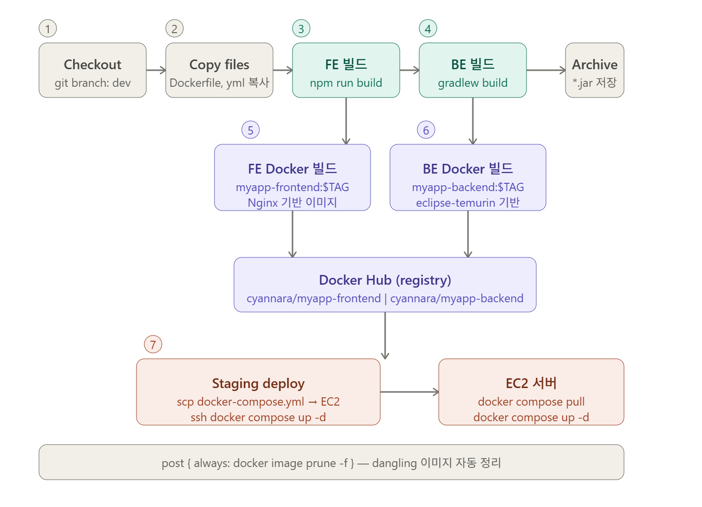
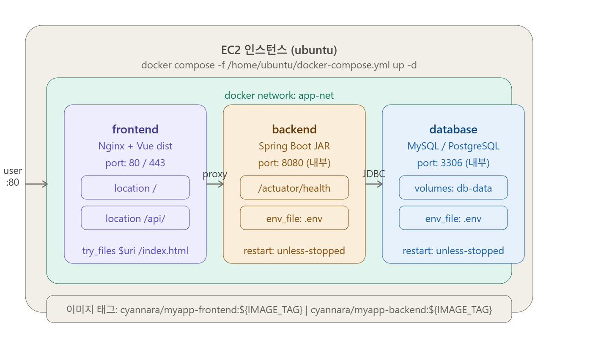

# Spring Boot + Vue + Jenkins + Nginx + Docker

## 아키텍쳐
```
[개발자]
   ↓ (git push)
[Git Repository]
   ↓
[Jenkins Pipeline]
   ↓ build
[Docker Image 생성]
   ↓ push
[Docker Registry]
   ↓ pull
[서버]
 ├─ Spring Boot (Container)
 ├─ Vue (Nginx Container)
 └─ Nginx (Reverse Proxy)
```
- Vue → build 후 정적파일 → Nginx에서 서빙
- Spring Boot → jar → Docker 컨테이너 실행
- Nginx → 프론트 + 백엔드 reverse proxy
- Jenkins → 전체 자동화




## wsl ubuntu에서 docker로 jenkins 설치

■ 1. 도커 컨테이너 실행

```sh
docker pull jenkins/jenkins:lts

# 내려받아진 이미지 repository 명 확인후에
docker images

# 컨테이너 이름 기억해둘것
docker run -d -p 8181:8080 \
-v /jenkins:/var/jenkins_home \
-v /var/run/docker.sock:/var/run/docker.sock \
--name jenkins \
-u root \
jenkins/jenkins:lts

# jenkins 컨테이너가 올라온 것을 확인  -> 컨테이너 ID확인해둘것
$ docker ps

# 초기패스워드 확인
$ docker exec jenkins cat /var/jenkins_home/secrets/initialAdminPassword

# 컨테이너 id 로 로그 확인
$ docker logs jenkins

# jenkins 컨테이너 루트 계정으로 접속
docker exec -it -u 0 jenkins bash

# 컨테이너 내부에 jdk 설치
apt-get update

# jdk 패키지 목록 조회
apt-cache search openjdk | grep 21

# jdk 설치
apt-get install -y  openjdk-21-jdk

# jdk 설치경로 확인
echo $JAVA_HOME                                      #/opt/java/openjdk

# npm 설치
apt-get install -y nodejs npm

# 컨테이너 내부에 docker 설치
apt-get update && apt-get install -y docker.io
docker --version

# 컨테이너 내부에 git 확인
which git                                           #/usr/bin/git 
# apt-get update && apt-get install -y git          # git이 없으면 설치
```

■ 2. 파일 준비

d:/deploy/backend/Dockerfile

```
FROM eclipse-temurin:21-jdk
WORKDIR /app
ARG JAR_FILE=build/libs/*.jar
COPY ${JAR_FILE} app.jar
ENV TZ=Asia/Seoul
EXPOSE 8080
ENTRYPOINT ["java","-jar","app.jar"]
```

d:/deploy/frontend/Dockerfile

```
FROM node:20-alpine AS builder
WORKDIR /app
COPY package*.json ./
RUN npm ci
COPY . .
RUN npm run build

FROM nginx:alpine
COPY --from=builder /app/dist /usr/share/nginx/html
COPY nginx.conf /etc/nginx/conf.d/default.conf
EXPOSE 80
```

d:/deploy/frontend/nginx.conf

```
server {
    listen 80;

    root /usr/share/nginx/html;
    index index.html;

    location / {
        try_files $uri $uri/ /index.html;
    }

    location /api/ {
        proxy_pass         http://backend:8080/;
        proxy_set_header   Host $host;
        proxy_set_header   X-Real-IP $remote_addr;
    }
}
```

docker-compose.yml
```
services:

  backend:
    image: ${BACK_IMAGE}:${IMAGE_TAG:-latest}
    container_name: backend
    restart: unless-stopped
    ports:
      - "8080:8080"
    env_file:
      - .env                  # DB_URL, JWT_SECRET 등 민감 정보
    networks:
      - app-net
    healthcheck:
      test: ["CMD", "wget", "-qO-", "http://localhost:8080/actuator/health"]
      interval: 30s
      retries: 3

  frontend:
    image: ${FRONT_IMAGE}:${IMAGE_TAG:-latest}
    container_name: frontend
    restart: unless-stopped
    ports:
      - "80:80"
      - "443:443"
    depends_on:
      - backend
    networks:
      - app-net
    volumes:
      - /etc/letsencrypt:/etc/letsencrypt:ro   # SSL 인증서 (선택)

networks:
  app-net:
    driver: bridge
```

파일복사

```
 sudo cp -r /mnt/d/deploy  /jenkins
```

■ 3. jenkins 환경설정

```
- tool
  jdk     -> jdk21  /opt/java/openjdk
  git     -> /usr/bin/git
  maven   -> maven3.9 install automatically
  gradle  -> gradle8  install automatically

- plugin
  Pipeline: Stage View
  Docker Pipeline
  SSH Agent
  Publish Over SSH
  SSH Pileline Steps
  Performance

- credential
  DockerHub_Credential ( type: Username with password)
  Staging-PrivateKey ( type: SSH Username with private key)


- system(옵션)
	Publish over SSH 설정
	 1. key 칸에 pem파일 복사해서 입력
         2. SSH Server :
		name             ==> ec2
		hostname         ==> ip주소
		username         ==> ec2-user
		remote directory ==> /home/ec2-user
```

■ 10. pipeline job 실행

실행권한 부여

```sh
sudo chown -R jenkins:jenkins /var/lib/jenkins/workspace
sudo usermod -aG docker jenkins
sudo systemctl restart jenkins
```

## Jenkins pipeline Script

```groovy
pipeline {
    agent any
    
    environment {
        IMAGE_TAG = "${BUILD_ID}"
        REGISTRY = "cyannara"
        BACK_IMAGE = "${REGISTRY}/myapp-backend:${IMAGE_TAG}"
        FRONT_IMAGE = "${REGISTRY}/myapp-frontend:${IMAGE_TAG}"
        
    }
    
    stages {
        stage('Checkout') {
            steps {
                // Get some code from a GitHub repository
                git (branch: 'dev'
                    , url:'https://github.com/cyannara/compath.git')
            }
        }
        
        stage('Copy Files') {
            steps {
                sh '''
                cp /var/jenkins_home/deploy/application.yml  back/src/main/resources/
                cp /var/jenkins_home/deploy/backend/Dockerfile  back/
                cp /var/jenkins_home/deploy/frontend/Dockerfile  front/
                cp /var/jenkins_home/deploy/frontend/nginx.conf front/
                cp /var/jenkins_home/deploy/docker-compose.yml ./
                '''
            }
        }        
 
        stage('Build Frontend') {
            steps {
                dir('front') {
                    sh 'npm install'
                    sh 'npm run build'
                }
            }
        }

        // stage('Build Frontend') {
        //     steps {
        //         dir('front') {
        //             sh '''
        //             docker run --rm \
        //             -v $PWD:/app \
        //             -w /app \
        //             node:20-alpine \
        //             sh -c "npm install && npm run build"
        //             '''
        //         }
        //     }
        // }

        stage('Build backend') {
            steps {
              dir('back') {
                sh '''
                chmod +x gradlew
                ./gradlew  clean build -x test
                '''
              }
            }
            
            post {
                success {
                    archiveArtifacts 'back/build/libs/*.jar'
                }
            }
        }      
       
        stage('Docker Image Build back') {
            steps {
                dir('back') {
                  script {
                    //oDockImage = docker.build(strDockerImage)
                    def bDockImage = docker.build(BACK_IMAGE, "--build-arg VERSION=${IMAGE_TAG} -f Dockerfile .")
                    docker.withRegistry('', 'DockerHub_Credential') {
                        bDockImage.push()
                    }
                  }
                }
            }
        }

        stage('Docker Image Build front') {
            steps {
                dir('front') {
                  script {
                    def fDockImage = docker.build(FRONT_IMAGE, "--build-arg VERSION=${IMAGE_TAG} -f Dockerfile .")
                    docker.withRegistry('', 'DockerHub_Credential') {
                        fDockImage.push()
                    }
                  }
                }
            }            
        }

        // stage('Docker Image Push') {
        //     steps {
        //         script {
        //             docker.withRegistry('', 'DockerHub_Credential') {
        //                 bDockImage.push()
        //             }
        //             docker.withRegistry('', 'DockerHub_Credential') {
        //                 fDockImage.push()
        //             }
        //         }
        //     }
        // }


        stage('Staging Deploy') {
            steps {
                sshagent(credentials: ['Staging-PrivateKey']) {
                    sh """
                    scp -i your-key.pem docker-compose.yml ubuntu@54.180.116.238:/home/ubuntu/docker-compose.yml
                    ssh -o StrictHostKeyChecking=no ubuntu@54.180.116.238 \
                "export IMAGE_TAG=${IMAGE_TAG} && \
                 export BACK_IMAGE=${BACK_IMAGE} && \
                 export FRONT_IMAGE=${FRONT_IMAGE} && \
                 export REGISTRY=${REGISTRY} && \
                         docker compose -f /home/ubuntu/docker-compose.yml pull && \
                         docker compose -f /home/ubuntu/docker-compose.yml up -d --remove-orphans"
                    """
                }
            }
        }
        
    }

    post {
        success { echo "✅ 빌드 #${env.BUILD_NUMBER} 배포 완료" }
        failure  { echo "❌ 빌드 #${env.BUILD_NUMBER} 실패" }
        always   {
            sh 'docker image prune -f'   // 로컬 dangling 이미지 정리
        }
    }
}
```
